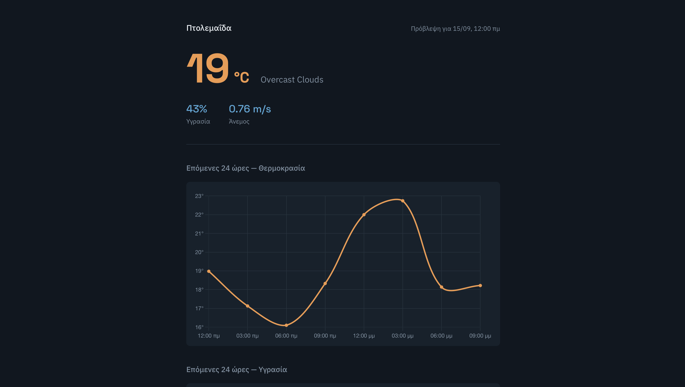

# Weather Data Pipeline


An end-to-end data pipeline that pulls weather forecasts, loads them into a cloud data warehouse, and serves them through a small dashboard — extending the data engineering work from my [MSc thesis](https://github.com/gpet01/RagProject) (MySQL → Redis) into a cloud/automation-focused project.

## What it does

1. **Extract** — pulls an 8-slot (24-hour) forecast for Ptolemaida from the OpenWeatherMap API.
2. **Load** — writes new forecast slots into a Google BigQuery table, skipping any slots already stored (deduplicated by `forecast_time`).
3. **Automate** — runs once a day, unattended, via a scheduled GitHub Actions workflow.
4. **Serve** — a Flask app queries BigQuery on request and renders the upcoming 24 hours as a small dashboard (current conditions + temperature/humidity charts).

## Stack

Python, Google BigQuery (free sandbox tier), GitHub Actions (scheduled automation), Flask, Chart.js.

## Architecture

```
OpenWeatherMap API → pipeline.py → BigQuery (forecasts table)
                                          |
                                          | (read-only queries)
                                          v
                                     main.py (Flask) → dashboard (HTML/CSS/JS)
```

`pipeline.py` and `main.py` never talk to each other directly — they only share the BigQuery table. One writes on a schedule, the other reads on demand.

## Setup

```bash
python3 -m venv venv
source venv/bin/activate
pip install -r requirements.txt
```

You'll need:
- A free [OpenWeatherMap](https://openweathermap.org/api) API key, in a `.env` file as `API_KEY=...`
- A Google Cloud project with BigQuery enabled (sandbox mode — no billing account needed)
- A service account JSON key with `BigQuery Data Editor` + `BigQuery Job User` roles, saved as `gcp-key.json` in the project root

```bash
python pipeline.py   # fetch + load once
python main.py        # start the dashboard at localhost:5001
```

For automation, the same two secrets (`OWM_API_KEY`, `GCP_SA_KEY`) are stored as GitHub Actions secrets and injected at runtime — neither ever touches the repo.

## What I ran into while building this

This project produced more real debugging than I expected, which turned out to be the most useful part of it.

**1. Forecast duplication.** The first version re-fetched the same 8 forecast slots on every run, inserting duplicates whenever the pipeline ran more than once in a short window. Fixed by querying BigQuery for existing `forecast_time` values before inserting, and only appending genuinely new slots.

**2. Schema type mismatches.** An early version let BigQuery auto-detect column types, which silently inferred `temp` as a STRING (because a formatting bug had appended `°C` directly onto the value). Switched to an explicit schema on load, so type errors surface immediately at insert time instead of breaking downstream SQL later.

**3. A `None` table, caused by case-sensitive env vars.** Reading `os.getenv("table_id")` instead of `os.getenv("TABLE_ID")` silently returned `None`, which BigQuery accepted as a literal table name — creating a table called "None" instead of raising an error. Environment variable lookups fail silently in a way that's easy to miss.

**4. The dashboard's "current" reading was actually the oldest reading.** The BigQuery table accumulates history indefinitely. Without a `WHERE forecast_time >= CURRENT_DATETIME()` filter, the query returned the entire history ordered from the start — so the "current conditions" hero section was showing whatever the *first ever* stored forecast was, not the nearest upcoming one. Easy to miss initially because the table had too little data for it to matter yet.

**5. Timezone handling.** OpenWeatherMap returns timestamps in UTC. Displaying them unconverted made the dashboard's "current" forecast look off by three hours against the actual local time. Fixed by explicitly converting to `Europe/Athens` in the frontend rather than applying a fixed offset, since a hardcoded offset breaks across daylight saving changes.

**6. GitHub Actions failed with a scoped-token permission error.** Pushing a `.github/workflows/` file requires a personal access token with `workflow` scope specifically — a token with only `repo` scope is silently insufficient and git rejects the push with a clear (if easy to miss) error.

**7. BigQuery sandbox mode doesn't allow DML.** `DELETE` queries fail on the free tier without a billing account; `DROP TABLE` (DDL) works fine and was used instead to reset the table during debugging.

## Known limitations / possible next steps

- Dashboard doesn't auto-refresh — requires a manual page reload to see new data
- No handling yet for the very first run before any data exists in BigQuery
- Location is hardcoded; a real version would let users search a city
- Free-tier forecast granularity is 3-hourly, not hourly (hourly requires OpenWeatherMap's paid One Call API)
- Basic error handling exists on both the API endpoint and the fetch pipeline, but there's no retry/alerting if a scheduled run fails